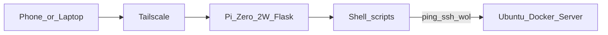

# pi-bridge — Project specification (v1)

## Purpose

A **minimal web UI** on a Raspberry Pi Zero 2 W that:

1. Shows whether the **Ubuntu Docker server** is **awake** or **asleep**.
2. Provides buttons to **Wake-on-LAN** and **suspend** the server by calling **existing shell scripts** on the Pi.

Access: browser → Pi **Tailscale IP** only. No public internet exposure in v1.

## System context



| Component | Role |
|-----------|------|
| Tailscale | Private network; only clients on tailnet reach the Pi |
| Flask app | Serves one page + JSON API; invokes scripts |
| Shell scripts | Status probe, WoL, suspend (already working via SSH today) |
| Ubuntu server | Immich, Nextcloud, etc.; suspended when not in use |

## Repository layout (v1)

```
pi-bridge/
├── AGENTS.md
├── project.md
├── tasks.md
├── README.md
├── requirements.txt          # flask only for v1
├── .env.example              # documented env vars, no secrets committed
├── app.py                    # Flask app + routes
├── config.py                 # reads env with safe defaults
├── templates/
│   └── index.html            # single dashboard page
└── scripts/                  # placeholders; real scripts copied/symlinked on Pi
    ├── status.sh
    ├── wake.sh
    └── suspend.sh
```

On the Pi, `scripts/*.sh` are the user's real scripts (or symlinks). The repo may ship **stub** scripts for local dev only if a task requires it.

## Configuration (environment variables)

| Variable | Default | Description |
|----------|---------|-------------|
| `PI_BRIDGE_HOST` | `0.0.0.0` | Bind address (Tailscale reaches via Pi's tailnet IP) |
| `PI_BRIDGE_PORT` | `8080` | HTTP port |
| `PI_BRIDGE_STATUS_SCRIPT` | `./scripts/status.sh` | Path to status script |
| `PI_BRIDGE_WAKE_SCRIPT` | `./scripts/wake.sh` | Path to wake script |
| `PI_BRIDGE_SUSPEND_SCRIPT` | `./scripts/suspend.sh` | Path to suspend script |
| `PI_BRIDGE_SCRIPT_TIMEOUT` | `30` | Seconds per script invocation |

Load from `.env` on the Pi (optional `python-dotenv` **only if** added in a task; otherwise export vars in systemd unit).

## Shell script contract (must match on Pi)

All scripts: executable (`chmod +x`), bash shebang, **exit code** is the contract (stdout/stderr for logs only).

### `status.sh`

- Exit `0` → server **awake** (ping/SSH checks pass per your existing logic).
- Exit `1` → server **asleep** (unreachable / suspended).
- Exit `2` (or any other) → **unknown** / error.

### `wake.sh`

- Exit `0` → WoL / wake action accepted (sent magic packet).
- Non-zero → failure (logged; show error in UI).

### `suspend.sh`

- Exit `0` → suspend command sent successfully.
- Non-zero → failure.

**Do not** change script internals in this project unless a task explicitly says "adapt stub script."

## HTTP API

Base URL: `http://<pi-tailscale-ip>:<PI_BRIDGE_PORT>`

| Method | Path | Purpose |
|--------|------|---------|
| `GET` | `/` | Dashboard HTML |
| `GET` | `/api/status` | JSON status from `status.sh` |
| `POST` | `/api/wake` | Run `wake.sh` |
| `POST` | `/api/suspend` | Run `suspend.sh` |

### `GET /api/status`

**Response 200**

```json
{
  "state": "awake",
  "checked_at": "2026-05-28T12:34:56+00:00"
}
```

`state` is one of: `awake` | `asleep` | `unknown` (mapped from script exit codes 0, 1, other).

**Response 500** — script missing, timeout, or non-executable:

```json
{ "error": "status_script_failed", "detail": "..." }
```

### `POST /api/wake` and `POST /api/suspend`

**Response 200** — script exit 0:

```json
{ "ok": true, "action": "wake" }
```

(`action` is `wake` or `suspend`.)

**Response 502** — script non-zero exit:

```json
{ "ok": false, "action": "wake", "detail": "..." }
```

**Response 500** — timeout, missing script, etc.

**Idempotency:** Not guaranteed. UI should disable buttons while a request is in flight.

## Web UI (single page)

**Route:** `GET /` → `templates/index.html`

### Layout

1. **Header:** Title "pi-bridge", subtitle "Homelab server control".
2. **Status card:**
   - Large indicator: **Awake** (green) / **Asleep** (muted) / **Unknown** (amber) / **Checking…** (neutral, while loading).
   - Line: "Last checked: <local time>" from `checked_at`.
   - Button: **Refresh status** (calls `GET /api/status`).
3. **Actions card:**
   - **Wake server** → `POST /api/wake`
   - **Suspend server** → `POST /api/suspend`
   - While request runs: disable both buttons, show short "Working…" message.
4. **Footer:** Static note "Tailscale only — not exposed to the public internet."

### Behavior

- On page load: fetch status once.
- Optional auto-refresh: **60s** interval (single `setInterval`; clear on navigation away not required for v1).
- After wake/suspend success: wait **3s**, then refresh status (server may not change instantly).
- Use `fetch` + `Content-Type: application/json` for POSTs (empty body `{}` is fine).
- Tailwind via CDN in `<head>`; dark-friendly neutral palette; mobile-first (phone from Tailscale).

### Styling constraints

- No custom CSS file in v1 unless a task adds one; Tailwind utility classes only.
- No images/icons CDN required; text + color states are enough.

## Python implementation notes

- **Framework:** Flask.
- **Template:** Jinja2 `render_template('index.html')`.
- **Script runner:** One helper, e.g. `run_script(path) -> (exit_code, stdout, stderr)`, used by all routes.
- **Logging:** `logging` module, INFO for invocations, WARNING/ERROR on failures.
- **Production on Pi:** systemd unit running `python3 app.py` or `flask --app app run` bound to `PI_BRIDGE_HOST`/`PI_BRIDGE_PORT`. No gunicorn in v1 unless a later task adds it.

## Out of scope (v1)

- HTTPS termination on the Pi (Tailscale encryption is sufficient for homelab v1).
- User accounts, API keys, CSRF tokens (tailnet trust model).
- History graphs, notifications, multiple servers.
- Rewriting WoL/suspend/status logic in Python.

## Success criteria

1. From a tailnet device, open `http://<pi-ip>:8080/` and see correct awake/asleep state.
2. Wake and Suspend buttons invoke the real scripts and show success/failure.
3. Idle RAM footprint remains modest (Flask process only; no extra daemons).
4. Total implementation follows `tasks.md` within ~2 hours.
